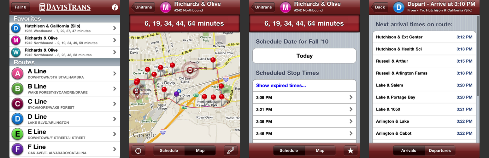

<h3 align="center">
  
</h3>

DavisTrans
==========

DavisTrans was an iOS app for receiving Unitrans transit information including stop prediction times, real-time bus locations, and schedule information. Developed by two UC Davis students (now alumni), Kip Nicol and Ken Zheng, as part of the Introduction to iPhone Application Development course in the fall of 2009.

The app was in service from 2010 to 2013 and is (unfortunately) no longer maintained. However, the project has now been open sourced and has been given a minor face lift to make it fit in with the iOS 7 design.

**iOS 4-6 Screenshots:**

